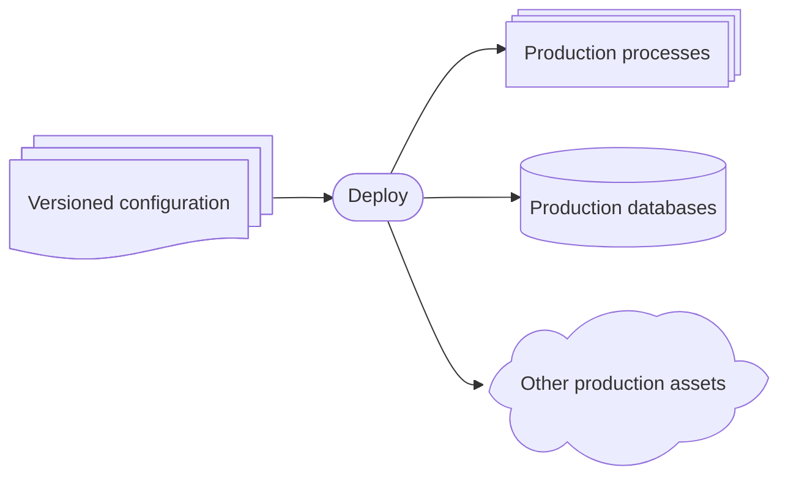
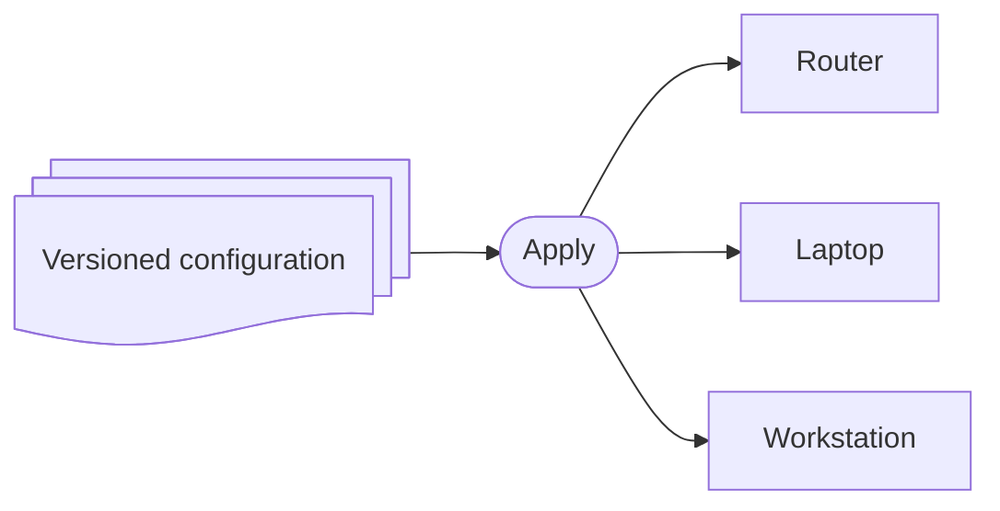

# Welcome

Over the 2024 end of year break, I completed a project to migrate my personal computing environments
to a modern, declarative configuration model. I'm quite excited about where I've landed. I've
created this mini-site to document the 'why' and 'how,' focusing on the gains in reliability,
security, and velocity.

The short version is that I've moved to a _declarative_
[Infrastructure as Code](https://en.wikipedia.org/wiki/Infrastructure_as_code) setup for all of my
hosts' operating systems, configuration, and home directories. I've also pivoted to a different way
of modeling and thinking about my machines, separating somewhat strictly _configuration_, from
_state_, from _data_.

That being said I don't believe in using "tech trend" words to describe setups, because these words
tend to only mean something once you invest enough into the underlying trends. I'll try my best to
describe what I did from a high-level point of view first, staying away from trends and
tech-specific jargon.

## The journey

How did I get there?

### Dotfiles management

Through my software engineering career, I've always versioned my personal configuration files, with
the goal of being able to switch to a new machine and setup my developer environment with a single
command, getting back to my usual levels of productivity in ~minutes. I don't want to be stressed
about the idea of losing or breaking a laptop, or having a hard-drive failing on me.

At work, I somewhat regularly grab a completely new VM and start afresh, to make sure I always
version my entire configuration, and test my setup scripts regularly. This makes me rather content
and feeling "safe" about my developer environment. I've witnessed, on the other hand, many
colleagues dreading and pushing back their workstation or VM upgrades, or having to postpone project
work until they fix a particular aspect of their developer workflow...

This was in my opinion a small long-term investment which very quickly paid off. I spent perhaps a
dozen days on this topic (cumulated), and this started yielding returns long ago.

This is often referred to a "dotfiles" management, with https://dotfiles.github.io/ giving you a
great primer. By now this concept is popular enough and I'd assume that the majority of professional
software developers have comparable setups.

### Wishing to extend this to the OS layers

But, of course, I looked into generalizing this approach to other areas, e.g. how much can I fully
automate and describe the final intended state of my machines and systems configurations.

Unfortunately, "Dotfiles" narrowly focuses on configuring often already-installed tools. On my (now
legacy) [nicdumz/dotfiles](https://github.com/nicdumz/dotfiles) setup, I did extend over time the
basic functionality, and added a couple of scripts to install Debian packages automatically, to,
again, be as close as possible to a "single script to setup my environment" workflow.

However, this quickly gets complicated if you own machines with diverse setups (Mac laptop vs Debian
workstation?), and in general doesn't take care of operating system level settings.

Linux sysadmins sometimes use or tout [etckeeper](https://wiki.archlinux.org/title/Etckeeper) to
"version" system configuration files, but this in my opinion falls short in several ways. The most
obvious problem in my opinion is that this approach does not distinguish between system defaults --
which shipped with the Operation System or a particular package from that OS -- from your own
customizations.

And, of course, you can litter your `/etc/` configuration files with comments about your intent:

```py title="/etc/ssh/ssh_config"
# BEGIN ndumazet 22/06/2022: make sure that chickens are allowed in
# whilst wolves stay out.
SomeSetting value
# END ndumazet
```

which minimizes the pain during OS level software updates, but every time I looked in this area I
never found fully satisfying solutions.

### Not quite: Orchestration

Docker Compose, Ansible, and similar tools would get close to what I seemed to need. I had
experience with Docker Compose to maintain my media server, and it was really useful to setup N
images and configure them in a versioned repository.

While these tools manage services effectively, they don't typically manage the entire operating
system with the same granular, reproducible control. This still left open the base OS level
configuration up to the system administrator, meaning "configuration drift" was still a risk.

### My every business day: IaC at work

At work, I configure production very much with an IaC approach.



The internal Google configuration language is called
[`Prodspec`](https://www.usenix.org/publications/loginonline/prodspec-and-annealing-intent-based-actuation-google-production)
and the control plane is called `Annealing`.

I'm very much used to only modifying the left-most box in this diagram: iterate on the configuration
and wait for it to be deployed. Long gone are the times where I can modify directly the target
systems on the right.

## Final form: IaC for my OS

What I've really been after, all along, was something like this:



Versioned configuration, leading to **reproducible** system-wide configurations.

Taken to an extreme: I can take my Laptop, completely wipe its state or replace its disks with new
disks, deploy again the OS configuration to this fresh hardware, and I will obtain an identical
system. I don't have to worry about the hard drive failing or about the hardware melting, because my
systems are configured in such a way that I can _assume_ these things will fail or will need
re-imaging.

How to get into this shape has been interesting, and the next pages on this mini website will expand
on how we got there.
